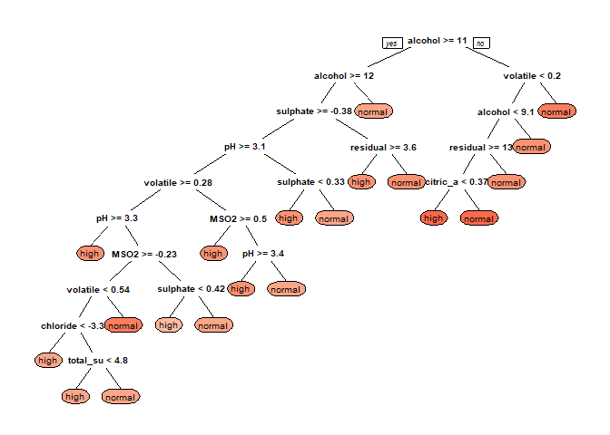

Data Analysis: Predicting Wine Quality
================

##### Christian Kim

### Introduction

In this analysis, we will be examining the chemical factors contributing to wine quality and comparing the performance of multi-class support vector machine (SVM), K-nearest neighbors (KNN), and decision tree algorithms when modeling the data. The dataset was taken from the UCI Machine Learning Repository and consists of Portuguese "Vinho Verde" red and white wine. The dataset includes the following columns:

Input variables (based on physicochemical tests):
1. fixed acidity
2. volatile acidity
3. citric acid
4. residual sugar
5. chlorides
6. free sulfur dioxide
7. total sulfur dioxide
8. density
9. pH
10. sulphates
11. alcohol
12. quality (score between 0 and 10)

### Loading and Cleaning the Data

``` r
library(readr)
library(Amelia)
```

    ## Loading required package: Rcpp

    ## ## 
    ## ## Amelia II: Multiple Imputation
    ## ## (Version 1.7.5, built: 2018-05-07)
    ## ## Copyright (C) 2005-2019 James Honaker, Gary King and Matthew Blackwell
    ## ## Refer to http://gking.harvard.edu/amelia/ for more information
    ## ##

``` r
library(corrplot)
```

    ## corrplot 0.84 loaded

``` r
library(dplyr)
```

    ## 
    ## Attaching package: 'dplyr'

    ## The following objects are masked from 'package:stats':
    ## 
    ##     filter, lag

    ## The following objects are masked from 'package:base':
    ## 
    ##     intersect, setdiff, setequal, union

``` r
library(caret)
```

    ## Loading required package: lattice

    ## Loading required package: ggplot2

``` r
library(nnet)
library(caTools)
library(ggplot2)
library(e1071)
library(ggpubr)
```

    ## Loading required package: magrittr

``` r
library(rpart)
library(rpart.plot)
```

To start, we load the data and replace all whitespaces in the column names with underscores. Once the column names are all acceptable, we can look at a summary of the data to check for missing values.

``` r
wine_data <- read_csv('winequalityN.csv')
```

    ## Parsed with column specification:
    ## cols(
    ##   type = col_character(),
    ##   `fixed acidity` = col_double(),
    ##   `volatile acidity` = col_double(),
    ##   `citric acid` = col_double(),
    ##   `residual sugar` = col_double(),
    ##   chlorides = col_double(),
    ##   `free sulfur dioxide` = col_double(),
    ##   `total sulfur dioxide` = col_double(),
    ##   density = col_double(),
    ##   pH = col_double(),
    ##   sulphates = col_double(),
    ##   alcohol = col_double(),
    ##   quality = col_double()
    ## )

``` r
wine_data <- wine_data %>% rename(fixed_acidity = 'fixed acidity', 
                                  volatile_acidity = 'volatile acidity',
                                  citric_acid = 'citric acid',
                                  residual_sugar = 'residual sugar',
                                  free_sulfur_dioxide = 'free sulfur dioxide',
                                  total_sulfur_dioxide = 'total sulfur dioxide'
                                  )
```

``` r
names(wine_data)
```

    ##  [1] "type"                 "fixed_acidity"        "volatile_acidity"    
    ##  [4] "citric_acid"          "residual_sugar"       "chlorides"           
    ##  [7] "free_sulfur_dioxide"  "total_sulfur_dioxide" "density"             
    ## [10] "pH"                   "sulphates"            "alcohol"             
    ## [13] "quality"

``` r
summary(wine_data)
```

    ##      type           fixed_acidity    volatile_acidity  citric_acid    
    ##  Length:6497        Min.   : 3.800   Min.   :0.0800   Min.   :0.0000  
    ##  Class :character   1st Qu.: 6.400   1st Qu.:0.2300   1st Qu.:0.2500  
    ##  Mode  :character   Median : 7.000   Median :0.2900   Median :0.3100  
    ##                     Mean   : 7.217   Mean   :0.3397   Mean   :0.3187  
    ##                     3rd Qu.: 7.700   3rd Qu.:0.4000   3rd Qu.:0.3900  
    ##                     Max.   :15.900   Max.   :1.5800   Max.   :1.6600  
    ##                     NA's   :10       NA's   :8        NA's   :3       
    ##  residual_sugar     chlorides       free_sulfur_dioxide
    ##  Min.   : 0.600   Min.   :0.00900   Min.   :  1.00     
    ##  1st Qu.: 1.800   1st Qu.:0.03800   1st Qu.: 17.00     
    ##  Median : 3.000   Median :0.04700   Median : 29.00     
    ##  Mean   : 5.444   Mean   :0.05604   Mean   : 30.53     
    ##  3rd Qu.: 8.100   3rd Qu.:0.06500   3rd Qu.: 41.00     
    ##  Max.   :65.800   Max.   :0.61100   Max.   :289.00     
    ##  NA's   :2        NA's   :2                            
    ##  total_sulfur_dioxide    density             pH          sulphates     
    ##  Min.   :  6.0        Min.   :0.9871   Min.   :2.720   Min.   :0.2200  
    ##  1st Qu.: 77.0        1st Qu.:0.9923   1st Qu.:3.110   1st Qu.:0.4300  
    ##  Median :118.0        Median :0.9949   Median :3.210   Median :0.5100  
    ##  Mean   :115.7        Mean   :0.9947   Mean   :3.218   Mean   :0.5312  
    ##  3rd Qu.:156.0        3rd Qu.:0.9970   3rd Qu.:3.320   3rd Qu.:0.6000  
    ##  Max.   :440.0        Max.   :1.0390   Max.   :4.010   Max.   :2.0000  
    ##                                        NA's   :9       NA's   :4       
    ##     alcohol         quality     
    ##  Min.   : 8.00   Min.   :3.000  
    ##  1st Qu.: 9.50   1st Qu.:5.000  
    ##  Median :10.30   Median :6.000  
    ##  Mean   :10.49   Mean   :5.818  
    ##  3rd Qu.:11.30   3rd Qu.:6.000  
    ##  Max.   :14.90   Max.   :9.000  
    ## 

This dataset contains a few missing values in several of the columns which need to be removed. We could simply delete every row with missing values, however, this would deteriorate our data. To avoid this, let's write a function that replaces the missing values with the mean value of that variable for each wine type.

``` r
#filling in the NA values

#function for replacing missing values
fill.NA <- function(column){
  vector <- column
  for (i in 1:length(column)){
    if (is.na(column[i]) & wine_data$type[i]=='white'){
      vector[i] <- mean(column[wine_data$type=='white'], na.rm=TRUE)
    } else if (is.na(column[i]) & wine_data$type[i]=='red'){
      vector[i] <- mean(column[wine_data$type=='red'], na.rm=TRUE)
    } else{
      vector[i] <- column[i]
    }
  }
  return(vector)
}

#columns with missing values
cols_NA <- c(
  'fixed_acidity', 
  'volatile_acidity', 
  'citric_acid', 
  'residual_sugar', 
  'chlorides', 
  'pH', 
  'sulphates'
  )

for (variable in cols_NA){
  wine_data[[variable]] <- fill.NA(wine_data[[variable]])
}
```

``` r
#no more missing values
missmap(wine_data, 
        main='Missingness Map of Wine Data',
        y.labels=NULL, 
        y.at=NULL,
        margins=c(10,10)
        )
```

    ## Warning in if (class(obj) == "amelia") {: the condition has length > 1 and
    ## only the first element will be used

    ## Warning: Unknown or uninitialised column: 'arguments'.

    ## Warning: Unknown or uninitialised column: 'arguments'.


### Exploring the Data

Now that there are no longer any missing values, we can start looking more closely at our variables. Let's begin by looking at the distribution of our outcome variable, wine quality.

``` r
ggplot(wine_data) +
  geom_bar(aes(quality), fill='#FF6666', alpha=0.80) +
  labs(title='Distribution of Wine by Quality')
```


As we saw in the summary, wine quality ranges from 3 to 9. However, there is a comparatively small number of wines that are distinctly high or low quality. Looking at the plot, we see that most wines in the dataset are of 'normal' quality, around quality score 6. Outside of that, there is a sharp decrease in the amount of wines that have a quality rating greater than 6 or less than 5. Our goal will be to build models that distinguish superlative and inferior wines from normal wines. To define the different classes of wine quality, we will use the cutoff of anything greater than 6 for high quality wine and anything less than 5 for low quality wine.

``` r
#divide quality scores into high, low, and normal 
wine_data$quality_class <- ifelse(wine_data$quality > 6, 'high', 'normal')
wine_data$quality_class <- ifelse(wine_data$quality < 5, 'low', wine_data$quality_class)

table(wine_data$quality_class)
```

    ## 
    ##   high    low normal 
    ##   1277    246   4974

This particular dataset combines data from both red and wine white. It is sensible to assume that the variables will have different effects on quality depending on what type of wine it is, so we will split the data by type and look at them separately.

``` r
#split the data by wine type
red_wine_data <- wine_data[wine_data$type == 'red', ] 
white_wine_data <- wine_data[wine_data$type == 'white', ]

#remove the type column
red_wine_data <- red_wine_data[,-1]
white_wine_data <- white_wine_data[,-1]

summary(red_wine_data)
```

    ##  fixed_acidity    volatile_acidity  citric_acid     residual_sugar  
    ##  Min.   : 4.600   Min.   :0.1200   Min.   :0.0000   Min.   : 0.900  
    ##  1st Qu.: 7.100   1st Qu.:0.3900   1st Qu.:0.0900   1st Qu.: 1.900  
    ##  Median : 7.900   Median :0.5200   Median :0.2600   Median : 2.200  
    ##  Mean   : 8.322   Mean   :0.5277   Mean   :0.2711   Mean   : 2.539  
    ##  3rd Qu.: 9.200   3rd Qu.:0.6400   3rd Qu.:0.4200   3rd Qu.: 2.600  
    ##  Max.   :15.900   Max.   :1.5800   Max.   :1.0000   Max.   :15.500  
    ##    chlorides       free_sulfur_dioxide total_sulfur_dioxide
    ##  Min.   :0.01200   Min.   : 1.00       Min.   :  6.00      
    ##  1st Qu.:0.07000   1st Qu.: 7.00       1st Qu.: 22.00      
    ##  Median :0.07900   Median :14.00       Median : 38.00      
    ##  Mean   :0.08747   Mean   :15.87       Mean   : 46.47      
    ##  3rd Qu.:0.09000   3rd Qu.:21.00       3rd Qu.: 62.00      
    ##  Max.   :0.61100   Max.   :72.00       Max.   :289.00      
    ##     density             pH          sulphates         alcohol     
    ##  Min.   :0.9901   Min.   :2.740   Min.   :0.3300   Min.   : 8.40  
    ##  1st Qu.:0.9956   1st Qu.:3.210   1st Qu.:0.5500   1st Qu.: 9.50  
    ##  Median :0.9968   Median :3.310   Median :0.6200   Median :10.20  
    ##  Mean   :0.9967   Mean   :3.311   Mean   :0.6581   Mean   :10.42  
    ##  3rd Qu.:0.9978   3rd Qu.:3.400   3rd Qu.:0.7300   3rd Qu.:11.10  
    ##  Max.   :1.0037   Max.   :4.010   Max.   :2.0000   Max.   :14.90  
    ##     quality      quality_class     
    ##  Min.   :3.000   Length:1599       
    ##  1st Qu.:5.000   Class :character  
    ##  Median :6.000   Mode  :character  
    ##  Mean   :5.636                     
    ##  3rd Qu.:6.000                     
    ##  Max.   :8.000

``` r
a <- ggplot(red_wine_data) +
  geom_bar(aes(quality), fill='#FF6666', alpha=0.80) +
  labs(title='Red Wine Quality')
b <- ggplot(white_wine_data) +
  geom_bar(aes(quality), fill='dodgerblue1', alpha=0.80) +
  labs(title='White Wine Quality')

ggarrange(a,b)
```


One thing that was not apparent in the previous summary is that white and red wine have slightly differing ranges of quality scores. Red wine goes up to 8 while white wine goes up to 9. However, there are not many observations of white wines with quality 9.

Now, let's look at the correlation between variables for both types of wine.

``` r
#red wine
corrplot(cor(select(red_wine_data, -c(quality_class))), title='Red Wine', mar=c(0,0,2,0))
```


``` r
#white wine
corrplot(cor(select(white_wine_data, -c(quality_class))), title='White Wine', mar=c(0,0,2,0))
```


For both types of wine, it would seem that alcohol is the only variable that has a distinct positive correlation with quality. Additionally, for red wine, volatile acidity, citric acid, total sulfur dioxide, density, and sulphates have a noticeable negative correlation with quality. Regarding white wine, the same applies to volatile acidity, chlorides, total sulfur dioxide, and density.

To further examine how effective these variables will be in predicting the different levels of wine quality, we will make density plots for each variable.

``` r
plots_red <- list()
plots_white <- list()

columns <- c(
  'fixed_acidity',
  'volatile_acidity',
  'citric_acid',
  'residual_sugar',
  'chlorides',
  'free_sulfur_dioxide',
  'total_sulfur_dioxide',
  'density',
  'pH',
  'sulphates',
  'alcohol'
)

plot.variables <- function(columns, df, title){
  for (variable in columns) {
  plot <- ggplot(df, aes_string(x=variable, fill='quality_class')) + 
    geom_density(col=NA, alpha=0.35) +
    labs(title=title)
  print(plot)
}
}
```

``` r
#red
plot.variables(columns, red_wine_data, 'Red Wine')
```


Of the plotted variables for red wine, volatile acidity, citric acid, sulphates, and alcohol seem to have the most distinctness between quality classes. However, low and normal quality wines consistently have overlapping distributions. Let's compare this behavior to that of white wine.

``` r
#white
plot.variables(columns, white_wine_data, 'White Wine')
```


Unlike red wine, this time only free sulfur dioxide, density, and alcohol have the most distinct distributions between classes. Similar to the pattern found in red wine, low and normal quality wines generally have significant overlap in their distributions. For both types of wine, we can expect this overlap to cause difficulty for our models when distinguishing between low and normal wines. Additionally, since there seems to be less distinctness between quality classes in white wine, our models will likely perform worse for white wine than for red wine.

For both types of wine, The most robust indicator of wine quality seems to be alcohol content. Generally speaking, higher quality wines have higher alcohol content than lower quality wines. However, as mentioned previously, alcohol content is not a good predictor of low quality wine when compared to normal quality wine.

Let's try adding a useful variable to our dataset through feature engineering. Free sulfur dioxide (SO2) plays an important role in sanitizing wine. However, the amount of SO2 needed to improve wine quality is dependant on pH. In this case, a more robust variable to use instead of free sulfur dioxide would be molecular sulfur dioxide (MSO2) which can be calculated from SO2 and pH.

``` r
#MSO2 = free SO2 / (1 + 10 ^ (pH - 1.81))

#adding the MSO2 column

#red
red_wine_data$MSO2 <- red_wine_data$free_sulfur_dioxide / (1 + 10 ^ (red_wine_data$pH - 1.81))
#white
white_wine_data$MSO2 <- white_wine_data$free_sulfur_dioxide / (1 + 10 ^ (white_wine_data$pH - 1.81))
```

``` r
#horizontal histograms for MSO2 

red_MSO2 <- ggplot(data=red_wine_data, aes(x=quality, y=MSO2)) + 
    stat_summary(fun.y=mean, geom='bar', fill='#FF6666', alpha=0.80) +
    coord_flip() +
    labs(title='Red Wine')
white_MSO2 <- ggplot(data=white_wine_data, aes(x=quality, y=MSO2)) + 
    stat_summary(fun.y=mean, geom='bar', fill='dodgerblue1', alpha=0.80) +
    coord_flip() +
    labs(title='White Wine')
ggarrange(red_MSO2, white_MSO2)
```


We can see from these plots that MSO2 behaves differently for each type of wine. For red wine, high quality wine requires about 0.4 units of MSO2 whereas white wine requires about 1.0. Furthermore, for white wine, a high MSO2 content is characteristic of inferior wine. Let's compare this with the density plots.

``` r
ggplot(red_wine_data, aes(x=MSO2, fill=quality_class)) + 
  geom_density(col=NA, alpha=0.35) +
  labs(title='Red Wine MSO2')
```


``` r
ggplot(white_wine_data, aes(x=MSO2, fill=quality_class)) + 
  geom_density(col=NA, alpha=0.35) +
  labs(title='White Wine MSO2')
```


It seems to be the case from these plots that the high MSO2 value for low quality white wine is the product of extreme outlier values. Additionally, these plots are heavily skewed to the right. In fact, as seen above, many of the variables are right-skewed. We will apply a log transformation to the variables with the largest correlation with quality for each type that are heavily skewed. This will help express the data in terms of relative changes in units rather than absolute changes.

``` r
red_vars <- c('total_sulfur_dioxide',
              'sulphates',
              'MSO2')

white_vars <- c('chlorides',
                'total_sulfur_dioxide',
                'density',
                'MSO2')

for (variable in red_vars){
  red_wine_data[[variable]] <- log(red_wine_data[[variable]])
}

for (variable in white_vars){
  white_wine_data[[variable]] <- log(white_wine_data[[variable]])
}
```

``` r
#MSO2 after log transformation
ggplot(red_wine_data, aes(x=MSO2, fill=quality_class)) + 
  geom_density(col=NA, alpha=0.35) +
  labs(title='Red Wine MSO2')
```


``` r
ggplot(white_wine_data, aes(x=MSO2, fill=quality_class)) + 
  geom_density(col=NA, alpha=0.35) +
  labs(title='White Wine MSO2')
```


Applying the log transformation shows that while high MSO2 content likely means low quality wine for white wine, low quality wine across types generally have lower MSO2 content. Furthermore, unlike other variables, low quality is the most distinct of the three classes whereas high and normal quality have significant overlap. This variable may help our models distinguish between low and normal quality wines.

### Modeling with SVM

Now we are ready to begin modeling our data. We will start with SVM, but before doing so, we need to prepare the data and separate it into train and test datasets.

``` r
#remove irrelevant columns
red_wine_data <- select(red_wine_data, -c(free_sulfur_dioxide, quality))
white_wine_data <- select(white_wine_data, -c(free_sulfur_dioxide, quality))

#scale the data for SVM
scale_red <- as.data.frame(sapply(red_wine_data, function(i) if(is.numeric(i)) scale(i) else i))
scale_white <- as.data.frame(sapply(white_wine_data, function(i) if(is.numeric(i)) scale(i) else i))
```

``` r
#make separate train and test datasets for each type

#red
set.seed(123)
sample <- sample.split(scale_red, SplitRatio = 0.8)
train_red <- subset(scale_red, sample == TRUE)
test_red <- subset(scale_red, sample == FALSE)

#white
sample <- sample.split(scale_white, SplitRatio = 0.8)
train_white <- subset(scale_white, sample == TRUE)
test_white <- subset(scale_white, sample == FALSE)

#accuracy calculating function
model.accuracy <- function(actual, predicted){
  error <- mean(actual != predicted)
  paste('Accuracy:', round(1-error, 4))
}
```

We will first build our model using all variables.

``` r
#SVM

#red 
model_red_1 <- svm(quality_class ~ ., 
                   data=train_red, 
                   type='C-classification', 
                   kernel='radial', 
                   gamma=0.1, 
                   cost=100
                   )

test_red$pred <- predict(model_red_1, test_red) #generate predictions
table(test_red$quality_class, test_red$pred) #confusion matrix
```

    ##         
    ##          high low normal
    ##   high     15   0     38
    ##   low       0   0     11
    ##   normal    0   0    335

``` r
with(test_red, model.accuracy(quality_class, pred)) #model accuracy
```

    ## [1] "Accuracy: 0.8772"

``` r
#white 
model_white_1 <- svm(quality_class ~ .,
                     data=train_white, 
                     type='C-classification', 
                     kernel='radial', 
                     gamma=0.1, 
                     cost=100
                     )

test_white$pred <- predict(model_white_1, test_white) #generate predictions
table(test_white$quality_class, test_white$pred) #confusion matrix
```

    ##         
    ##          high low normal
    ##   high    118   0    154
    ##   low       1   5     39
    ##   normal   21   0    886

``` r
with(test_white, model.accuracy(quality_class, pred)) #model accuracy
```

    ## [1] "Accuracy: 0.8243"

From the confusion matrices it is apparent that the model struggles with correctly predicting low quality wine. In fact, in the case of red wine, it didn't predict low quality wine at all. This supports the previously made prediction that the significant overlap between low and normal quality wines in terms of chemical factors will make it difficult for our models to correctly predict low quality wine.

Let's compare this to a new model using only the variables with the largest correlation to quality and MSO2.

``` r
#red 
model_red_2 <- svm(quality_class ~ 
                     volatile_acidity + 
                     citric_acid + 
                     total_sulfur_dioxide + 
                     density + 
                     sulphates + 
                     alcohol + 
                     MSO2, 
                     data=train_red, 
                     type='C-classification', 
                     kernel='radial', 
                     gamma=0.1, 
                     cost=100
                     )

test_red$pred <- predict(model_red_2, test_red)
table(test_red$quality_class, test_red$pred)
```

    ##         
    ##          high low normal
    ##   high     18   0     35
    ##   low       0   0     11
    ##   normal    3   0    332

``` r
with(test_red, model.accuracy(quality_class, pred))
```

    ## [1] "Accuracy: 0.8772"

``` r
#white 
model_white_2 <- svm(quality_class ~ 
                       volatile_acidity + 
                       chlorides + 
                       total_sulfur_dioxide + 
                       density + 
                       alcohol + 
                       MSO2, 
                       data=train_white, 
                       type='C-classification', 
                       kernel='radial', 
                       gamma=0.1, 
                       cost=100
                       )

test_white$pred <- predict(model_white_2, test_white)
table(test_white$quality_class, test_white$pred)
```

    ##         
    ##          high low normal
    ##   high    141   0    131
    ##   low       2   5     38
    ##   normal   42   0    865

``` r
with(test_white, model.accuracy(quality_class, pred))
```

    ## [1] "Accuracy: 0.826"

This new model slightly improves the accuracy for white wine and maintains the accuracy for red wine. As it includes only the most important variables, this model is preferable to the model which uses all variables.

### Comparing SVM to KNN and Decision Tree

Let's now compare the performance of SVM to KNN and a decision tree. We will start by making new train and test datasets from before we scaled our data.

``` r
#make new train and test from data before scaling

#red
set.seed(123)
sample <- sample.split(red_wine_data, SplitRatio = 0.8)
train_red <- subset(red_wine_data, sample == TRUE)
```

    ## Warning: Length of logical index must be 1 or 1599, not 12

``` r
test_red <- subset(red_wine_data, sample == FALSE)
```

    ## Warning: Length of logical index must be 1 or 1599, not 12

``` r
#white
sample <- sample.split(white_wine_data, SplitRatio = 0.8)
train_white <- subset(white_wine_data, sample == TRUE)
```

    ## Warning: Length of logical index must be 1 or 4898, not 12

``` r
test_white <- subset(white_wine_data, sample == FALSE)
```

    ## Warning: Length of logical index must be 1 or 4898, not 12

``` r
#red KNN

#convert outcome variable to factor
train_red[["quality_class"]] <- factor(train_red[["quality_class"]])
test_red[["quality_class"]] <- factor(test_red[["quality_class"]])

#10-fold CV repeated 3 times
set.seed(123)
train.control = trainControl(method = 'repeatedcv', number=10, repeats=3)

#training the model
model_red_KNN <- train(quality_class ~ ., 
                       data=train_red, 
                       method='knn', 
                       trControl=train.control,
                       preProcess=c('center','scale'),
                       tuneGrid = expand.grid(k=1:20)
                       )

summary(model_red_KNN)
```

    ##             Length Class      Mode     
    ## learn        2     -none-     list     
    ## k            1     -none-     numeric  
    ## theDots      0     -none-     list     
    ## xNames      11     -none-     character
    ## problemType  1     -none-     character
    ## tuneValue    1     data.frame list     
    ## obsLevels    3     -none-     character
    ## param        0     -none-     list

``` r
print(model_red_KNN)
```

    ## k-Nearest Neighbors 
    ## 
    ## 1200 samples
    ##   11 predictor
    ##    3 classes: 'high', 'low', 'normal' 
    ## 
    ## Pre-processing: centered (11), scaled (11) 
    ## Resampling: Cross-Validated (10 fold, repeated 3 times) 
    ## Summary of sample sizes: 1080, 1079, 1080, 1081, 1081, 1080, ... 
    ## Resampling results across tuning parameters:
    ## 
    ##   k   Accuracy   Kappa    
    ##    1  0.8269900  0.4263372
    ##    2  0.7950141  0.3346462
    ##    3  0.8227840  0.3648624
    ##    4  0.8183162  0.3303913
    ##    5  0.8255456  0.3224754
    ##    6  0.8350042  0.3433865
    ##    7  0.8363748  0.3476318
    ##    8  0.8352707  0.3382711
    ##    9  0.8336109  0.3240483
    ##   10  0.8327867  0.3260291
    ##   11  0.8341778  0.3234212
    ##   12  0.8364048  0.3304125
    ##   13  0.8366987  0.3246124
    ##   14  0.8369696  0.3177394
    ##   15  0.8369674  0.3165893
    ##   16  0.8389119  0.3241422
    ##   17  0.8378054  0.3036731
    ##   18  0.8366964  0.2972654
    ##   19  0.8375369  0.2931506
    ##   20  0.8355945  0.2883066
    ## 
    ## Accuracy was used to select the optimal model using the largest value.
    ## The final value used for the model was k = 16.

``` r
test_red$pred <- predict(model_red_KNN, test_red)
with(test_red, model.accuracy(quality_class, pred))
```

    ## [1] "Accuracy: 0.8596"

``` r
plot(model_red_KNN, main='Red Wine')
```


``` r
table(test_red$quality_class, test_red$pred)
```

    ##         
    ##          high low normal
    ##   high     17   0     36
    ##   low       1   0     10
    ##   normal    9   0    326

``` r
#white KNN

train_white[["quality_class"]] <- factor(train_white[["quality_class"]])
test_white[["quality_class"]] <- factor(test_white[["quality_class"]])


model_white_KNN <- train(quality_class ~ ., 
                       data=train_white, 
                       method='knn', 
                       trControl=train.control,
                       preProcess=c('center','scale'),
                       tuneGrid = expand.grid(k=1:20)
                       )

summary(model_white_KNN)
```

    ##             Length Class      Mode     
    ## learn        2     -none-     list     
    ## k            1     -none-     numeric  
    ## theDots      0     -none-     list     
    ## xNames      11     -none-     character
    ## problemType  1     -none-     character
    ## tuneValue    1     data.frame list     
    ## obsLevels    3     -none-     character
    ## param        0     -none-     list

``` r
print(model_white_KNN)
```

    ## k-Nearest Neighbors 
    ## 
    ## 3674 samples
    ##   11 predictor
    ##    3 classes: 'high', 'low', 'normal' 
    ## 
    ## Pre-processing: centered (11), scaled (11) 
    ## Resampling: Cross-Validated (10 fold, repeated 3 times) 
    ## Summary of sample sizes: 3306, 3307, 3307, 3307, 3306, 3308, ... 
    ## Resampling results across tuning parameters:
    ## 
    ##   k   Accuracy   Kappa    
    ##    1  0.7899701  0.4656432
    ##    2  0.7521354  0.3660833
    ##    3  0.7631163  0.3596621
    ##    4  0.7606642  0.3447417
    ##    5  0.7669251  0.3422259
    ##    6  0.7657466  0.3336570
    ##    7  0.7673815  0.3277998
    ##    8  0.7691025  0.3303752
    ##    9  0.7718213  0.3267852
    ##   10  0.7733607  0.3342009
    ##   11  0.7729989  0.3303248
    ##   12  0.7732706  0.3243997
    ##   13  0.7743605  0.3220108
    ##   14  0.7708213  0.3081994
    ##   15  0.7742658  0.3140864
    ##   16  0.7727182  0.3045528
    ##   17  0.7724490  0.2973481
    ##   18  0.7724485  0.2979203
    ##   19  0.7734505  0.2952089
    ##   20  0.7749043  0.2983380
    ## 
    ## Accuracy was used to select the optimal model using the largest value.
    ## The final value used for the model was k = 1.

``` r
test_white$pred <- predict(model_white_KNN, test_white)
with(test_white, model.accuracy(quality_class, pred))
```

    ## [1] "Accuracy: 0.8121"

``` r
plot(model_white_KNN, main='White Wine')
```


``` r
table(test_white$quality_class, test_white$pred)
```

    ##         
    ##          high low normal
    ##   high    176   2     94
    ##   low       0  16     29
    ##   normal   84  21    802

Although KNN seems to perform slightly worse than SVM, it is a little better at predicting low quality white wines. For white wine, although k=1 returns the highest accuracy, it would be more robust to overfitting if we chose a higher k value. Thus, k=13 would be a better choice. With this k-value we can expect an accuracy of about 77% for white wine.

Now, let's compare this to a decision trees.

``` r
#recombine our train and test datasets

#re-add type column
train_red$type <- 'red'
train_white$type <- 'white'
test_red$type <- 'red'
test_white$type <- 'white'

#combine the datasets
train_full <- rbind(train_red, train_white)
test_full <- rbind(test_red, test_white)


#10-fold CV with 3 repeats
set.seed(123)
train.control = trainControl(method = 'repeatedcv', number=10, repeats=3)

#training the model
model_tree <- train(quality_class~ .,
                    data=train_full,
                    method='rpart',
                    trControl=train.control,
                    tuneLength=10
                    )
model_tree
```

    ## CART 
    ## 
    ## 4874 samples
    ##   12 predictor
    ##    3 classes: 'high', 'low', 'normal' 
    ## 
    ## No pre-processing
    ## Resampling: Cross-Validated (10 fold, repeated 3 times) 
    ## Summary of sample sizes: 4386, 4386, 4387, 4386, 4387, 4387, ... 
    ## Resampling results across tuning parameters:
    ## 
    ##   cp           Accuracy   Kappa     
    ##   0.003502627  0.7821747  0.27894605
    ##   0.003627721  0.7816283  0.27707722
    ##   0.003940455  0.7812185  0.26916413
    ##   0.004378284  0.7827930  0.26390028
    ##   0.005253940  0.7821795  0.24676708
    ##   0.006129597  0.7800592  0.24055747
    ##   0.008172796  0.7737666  0.19569952
    ##   0.014010508  0.7691855  0.12617275
    ##   0.015761821  0.7678859  0.08956536
    ##   0.016418564  0.7674752  0.06383655
    ## 
    ## Accuracy was used to select the optimal model using the largest value.
    ## The final value used for the model was cp = 0.004378284.

``` r
#make our predictions
test_full$pred <- predict(model_tree, test_full)
with(test_full, model.accuracy(quality_class, pred))
```

    ## [1] "Accuracy: 0.7961"

``` r
prp(model_tree$finalModel, box.palette='Reds', tweak=1.2)
```



Once again, we can see that decision tree also struggles with predicting low quality wines as no terminal nodes result in a 'low' prediction.

``` r
plot(varImp(model_tree))
```


### Concluding Remarks

Overall, with this dataset, SVM seems to be the best model for predicting wine quality. However, KNN performed better than SVM when predicting true positive low quality white wines. In regards to the chemical factors that contribute most to wine quality, alcohol seems to be the most important variable by far. Surprisingly, MSO2 contributed less to the model's accuracy than was expected, at least in the case of decision trees.

It is reasonable to assume that predicting subjectively rated wine quality based solely on chemical factors will have its limits. While there is a distinct chemical factor that can set apart high quality wine from the rest, namely alcohol, no such chemical factor exists to the same degree for low quality wine. Thus, wine perceived as being distinctly low quality will likely be influenced by many other non-chemical factors. This is supported by the density plots above which show that low quality wine, in terms of chemical characteristics, has many overlaps with normal quality wine.
